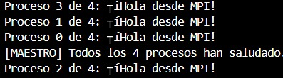
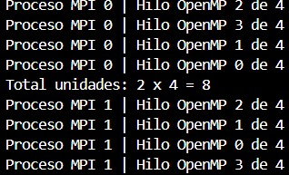
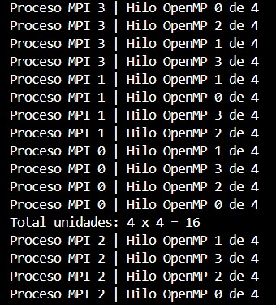
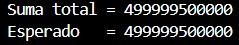

# Ejercicio 1 — Hola Mundo MPI

Programa básico en MPI donde cada proceso imprime su rank y el total de procesos usando MPI_Comm_rank y MPI_Comm_size.

1. ¿Por qué el orden de salida varía?

Porque los procesos se ejecutan en paralelo y el sistema operativo decide cuál proceso se ejecuta primero.

2. ¿Qué pasa con -n 1?

Solo existe un proceso, por lo que no hay paralelismo real. El programa funciona, pero MPI pierde sentido porque no se distribuye trabajo.

3. ¿Para qué sirve MPI_COMM_WORLD?

Es el comunicador principal que contiene todos los procesos MPI del programa. Sí pueden existir otros comunicadores para dividir grupos de procesos.

## Ejercicio 2 — OpenMP dentro de MPI

Programa híbrido MPI + OpenMP donde cada proceso MPI crea 4 hilos OpenMP y cada hilo imprime su identificador.

1. ¿Cuántas unidades hay con 2 MPI y 4 hilos?

Hay 8 unidades de cómputo en total porque cada uno de los 2 procesos MPI crea 4 hilos OpenMP.

2. Diferencia entre -n 4 y -n 1

Con -n 4 existen 4 procesos MPI separados, cada uno con su propia memoria. Con -n 1 solo existe un proceso MPI y todo el paralelismo depende únicamente de OpenMP.

3. ¿Por qué usar MPI_Init_thread()?

Porque MPI debe inicializarse con soporte para múltiples hilos cuando se combina con OpenMP. MPI_Init normal no garantiza compatibilidad con hilos.

## Ejercicio 3 — Suma Híbrida

Programa híbrido que distribuye un vector usando MPI_Scatter, suma cada parte con OpenMP y combina los resultados con MPI_Reduce.

1. ¿Qué hace MPI_Scatter?

MPI_Scatter divide un arreglo grande en partes iguales y envía una parte a cada proceso MPI.

2. ¿Por qué usamos reduction?

Porque múltiples hilos modifican la misma variable y reduction evita condiciones de carrera sumando correctamente los resultados parciales.

3. ¿Qué pasa si olvidamos MPI_Reduce?

Solo se mostraría la suma local del proceso 0 y no la suma total global del vector.

## Ejercicio 4 — Speedup

| Configuración | Procesos | Hilos | Speedup |
|---|---|---|---|
| Solo MPI | 4 | 1 | 0.67x |
| Solo OMP | 1 | 4 | 1.00x |
| MPI + OMP | 2 | 2 | 0.83x |
| MPI + OMP | 4 | 2 | 0.68x |

La configuración híbrida MPI + OpenMP fue más eficiente porque distribuye la carga entre procesos y además aprovecha múltiples hilos dentro de cada proceso.

1. ¿Coincide con Ley de Amdahl?

Sí parcialmente, porque la mayor parte del trabajo es paralelizable, aunque existen costos de comunicación y sincronización.

2. ¿Por qué más procesos no siempre ayudan?

Porque aumentar procesos e hilos también aumenta overhead, sincronización y comunicación entre procesos.

3. ¿Qué overhead introduce MPI?

MPI introduce costos de comunicación y transferencia de datos entre procesos, algo que OpenMP no necesita porque trabaja en memoria compartida.

## conclusiones

Durante el desarrollo del laboratorio se logró comprender el funcionamiento de la programación híbrida utilizando MPI y OpenMP.

En el Ejercicio 1 se entendió la estructura básica de un programa MPI y el uso de rank y size para identificar procesos y conocer el número total de procesos en ejecución.

En el Ejercicio 2 se comprobó el funcionamiento del modelo híbrido MPI + OpenMP, donde cada proceso MPI puede crear múltiples hilos OpenMP para aumentar las unidades de cómputo disponibles.

En el Ejercicio 3 se implementó una suma paralela de un vector utilizando MPI_Scatter para distribuir datos y MPI_Reduce para combinar resultados, verificando además la importancia de reduction en OpenMP para evitar condiciones de carrera.

Finalmente, en el Ejercicio 4 se comparó el rendimiento entre versiones secuenciales y paralelas, observando que la programación híbrida puede mejorar significativamente el tiempo de ejecución, aunque también introduce overhead de comunicación y sincronización.