# Taller CUDA - Programación Paralela

## Descripción

Este repositorio contiene una colección de ejercicios básicos e intermedios de CUDA enfocados en:

- Transferencia de datos CPU ↔ GPU
- Uso de kernels
- Indexación de hilos
- Shared Memory
- Reducción paralela
- Medición de rendimiento
- Comparación CPU vs GPU

---

# Hola GPU: Mi primer programa CUDA

## Categoria: CPU → GPU → CPU (Básico).

Escribe un programa que inicialice un arreglo de enteros en la CPU, lo copie a la GPU, luego de vuelta a la CPU y verifique que los datos llegaron intactos. Esto comprueba que el flujo de transferencia funciona correctamente. 

---

### Evidencia ejecución

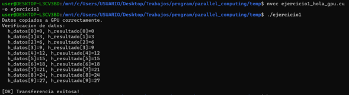

---

# Ejercicio 2: Copia de Matriz 2D CPU ↔ GPU 

## Categoria: CPU → GPU → CPU (Transferencia 2D) 

Transfiere una matriz 3x4 de floats entre CPU y GPU. La GPU no realiza ningún cálculo, solo almacena los datos. Imprime la matriz antes y después de la transferencia para verificar. Esto enseña a calcular correctamente el tamaño en bytes para arreglos multidimensionales. 

---

### Evidencia ejecucion

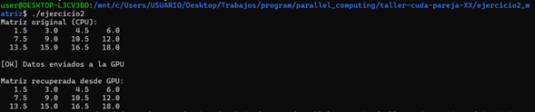

---

## Tarea realizada

- Modifica el programa para verificar automáticamente que cada elemento de h_original == h_recuperada. 
- Pista: usa un bucle y compara con fabsf(a - b) < 1e-5f 

### Evidencia tarea

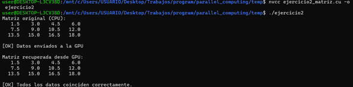

---

# Ejercicio 3: Información del Device: Conoce tu GPU 

## Categoría: Consulta de propiedades del Device 

Escribe un programa que consulte e imprima las propiedades de la GPU instalada: nombre, cantidad de núcleos, memoria total, tamaño máximo de bloque, etc. Esto es fundamental para entender las capacidades de tu hardware antes de optimizar código. 

---

### Evidencia ejecución

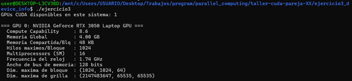

---

## Tarea realizada

 - TAREA: Calcula e imprime cuantos hilos en total puede lanzar esta GPU
 - Total hilos = SM * maxThreadsPerMultiProcessor 

### Evidencia tarea

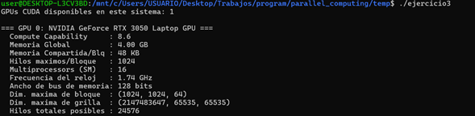

---

# Ejercicio 4: Suma de Vectores Paralela 

## Categoría: Kernels Básicos GPU 

Implementa la suma de dos vectores de N=1,000,000 elementos en la GPU. Cada hilo suma un par de elementos. Compara el resultado con la suma en CPU para verificar la corrección. Este es el 'Hola Mundo' clásico de CUDA. 

---

### Evidencia ejecución

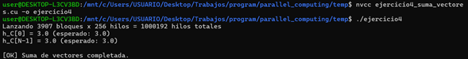

---

# Ejercicio 5: Cuadrado de Elementos (In-place) 

## Categoría: Kernels Básicos GPU

Eleva al cuadrado cada elemento de un arreglo directamente en la GPU (in-place: el resultado se escribe sobre el mismo arreglo de entrada). Inicializa el arreglo con valores del 1 al N en la CPU, procésalo en GPU, y verifica los resultados en CPU. 

---

### Evidencia ejecución

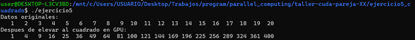

---

## Tarea realizada

 - TAREA: Verifica que cada elemento es igual a (i+1)^2
 - Imprime si hay algun error 

### Evidencia tarea

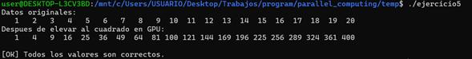
---

# Ejercicio 6: Kernel 2D: Inicialización de Matriz 

## Categoría: Kernels Básicos GPU - 2D 

Usa un kernel con bloques e hilos bidimensionales para inicializar una matriz M x N en la GPU, donde cada elemento mat[i][j] = i * N + j (su índice lineal). Copia el resultado a la CPU y verifica. Este ejercicio enseña el uso de índices 2D en CUDA.

---

### Evidencia ejecución

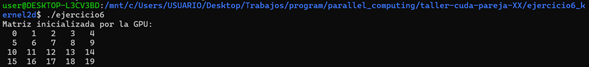

---

## Tarea realizada

- TAREA: Modifica el kernel para que mat[i][j] = i + j en vez del índice lineal 

### Evidencia tarea

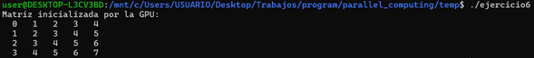

---

# Ejercicio 7: Reducción Paralela: Suma de un Arreglo con Shared Memory 

## Categoría: Intermedio - Shared Memory y Reducción 

Implementa la suma de todos los elementos de un arreglo usando reducción paralela con shared memory. La reducción es un patrón fundamental en computación paralela: en cada paso, la mitad de los hilos suman su elemento con el del hilo opuesto, hasta obtener la suma total en el hilo 0 del bloque. 

---

### Evidencia ejecución

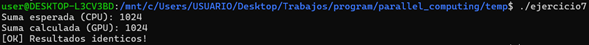

---

# Ejercicio 8: Multiplicación Escalar y Medición de Tiempo 

## Categoría: Intermedio - Rendimiento y Eventos CUDA 

Multiplica cada elemento de un vector de 10 millones de floats por un escalar en la GPU. Mide el tiempo de ejecución usando CUDA Events (la forma correcta de medir tiempo en GPU) y calcula el ancho de banda de memoria efectivo. Compara con la velocidad en CPU. 

---

### Evidencia ejecución

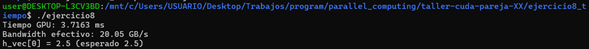

---

## Tarea realizada
- TAREA: Implementa la misma operacion en CPU con clock() y compara los tiempos. 

### Evidencia tarea

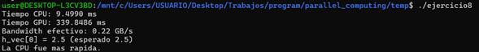

---

# Ejercicio 9: Producto Punto de Vectores

## Categoría: Intermedio - Combinación de patrones 

Calcula el producto punto (dot product) de dos vectores: suma de a[i]*b[i] para todo i. Usa reducción paralela: cada bloque calcula la suma parcial de su porción, y luego la CPU suma todos los resultados parciales. Inicializa ambos vectores con 1.0f, el resultado debe ser N. 

---

### Evidencia ejecución

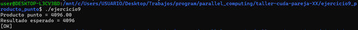

---

## Tarea realizada

- TAREA: Prueba con vectores aleatorios y verifica contra resultado en CPU. 

### Evidencia tarea

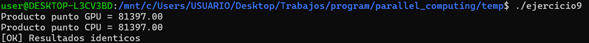

